<div align="center">

# ✈️ Ofogh Air Agency

### A complete travel-agency platform: search flights, book hotels, pay online, and manage everything from an admin panel.

<br>


<br>

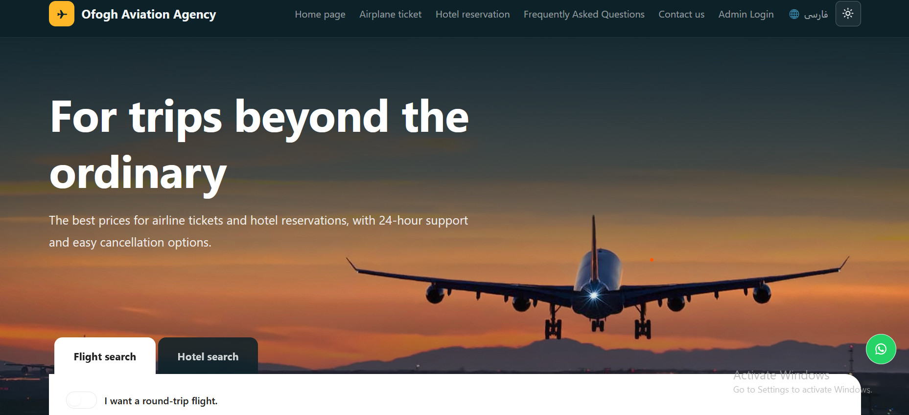

</div>

---

## 🌍 What is this?

**Ofogh Air Agency** is not just a travel-themed landing page. It is a working booking system. A visitor can find a flight or hotel, reserve it, pay for it, and the agency staff can manage every reservation from a protected admin area.

> **Browse → Select → Reserve → Pay → Verify → Confirmed**

with real business rules behind it: seat capacity, double-booking protection, last-minute discounts, temporary booking locks, and payment verification.

---

## ✨ Features

### 🏠 Home page

<table>
<tr>
<td width="56%" valign="top">

A landing page designed to turn visitors into bookings.

<ul>
<li><b>Search widget</b> for flights and hotels, with date pickers</li>
<li><b>Last-minute flights board:</b> departures 1–2 days away, discounted, with instant booking</li>
<li><b>Last-minute hotel deals:</b> rooms that are free in the next day or two, also discounted</li>
<li><b>Domestic and international tours</b> with regional descriptions</li>
<li><b>User reviews</b> list plus a horizontal review slider</li>
<li><b>FAQ</b> accordion, footer quick links, WhatsApp shortcut</li>
</ul>

</td>
<td width="44%" align="center" valign="middle">
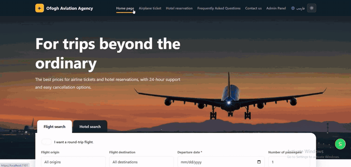
</td>
</tr>
</table>

### ✈️ Flight search

<table>
<tr>
<td width="56%" valign="top">

Find flights by date, one-way or round trip.

<ul>
<li>Pick one or two dates; for a round trip, <b>return flights are shown only if they exist on the return date</b></li>
<li>Ticket price, class, date and entry time on every result</li>
<li><b>Capacity enforcement:</b> a flight with 15 seats never sells the 16th ticket</li>
<li>Passenger booking with mobile-number validation and automatic total price</li>
</ul>

</td>
<td width="44%" align="center" valign="middle">
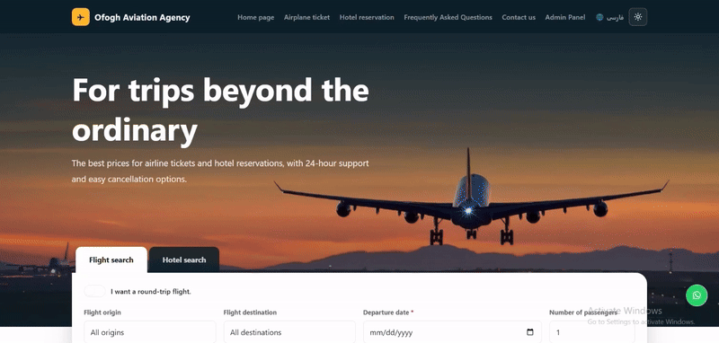
</td>
</tr>
</table>

### 🏨 Hotel search

<table>
<tr>
<td width="56%" valign="top">

Search by destination, dates and number of guests.

<ul>
<li>Every hotel lists its rooms, each with its own capacity and price</li>
<li>Star rating, meal plan, amenities and photo galleries</li>
<li><b>No double booking:</b> a room reserved for a date range can't be reserved again</li>
<li>Changing the destination updates the results for that city</li>
<li>Automatic night count and total price</li>
</ul>

</td>
<td width="44%" align="center" valign="middle">
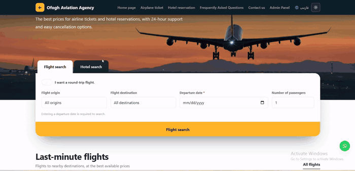
</td>
</tr>
</table>

### 💳 Booking and payment

<table>
<tr>
<td width="56%" valign="top">

From reservation to a confirmed payment.

<ul>
<li>Enter traveler details, review a <b>preview</b>, then pay</li>
<li>Built on an <code>IPaymentGateway</code> abstraction</li>
<li><b>ZarinPal</b> gateway with real request + verification flow</li>
<li><b>Fake</b> gateway to test the whole flow without a bank account</li>
<li>Payment authority, reference and time are stored per booking</li>
</ul>

</td>
<td width="44%" align="center" valign="middle">
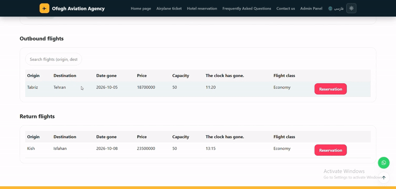
</td>
</tr>
</table>

### 🌐 Persian and English

<table>
<tr>
<td width="56%" valign="top">

The whole interface switches language in one click.

<ul>
<li><b>Persian (RTL)</b> and <b>English (LTR)</b> layouts</li>
<li>Localized validation messages</li>
<li>Separate RTL / LTR Bootstrap handling</li>
</ul>

</td>
<td width="44%" align="center" valign="middle">
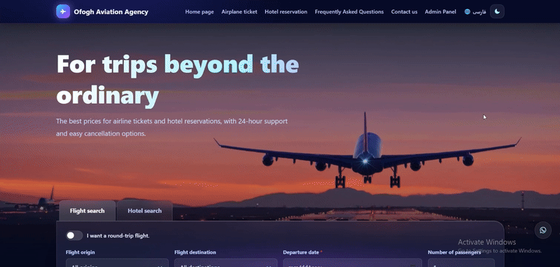
</td>
</tr>
</table>

### 🌗 Light and dark themes

<table>
<tr>
<td width="56%" valign="top">

Two complete themes, designed for every page.

<ul>
<li><b>Light:</b> white, orange and pink</li>
<li><b>Dark:</b> black and purple</li>
<li>Scroll-reveal animations and responsive layouts</li>
</ul>

</td>
<td width="44%" align="center" valign="middle">
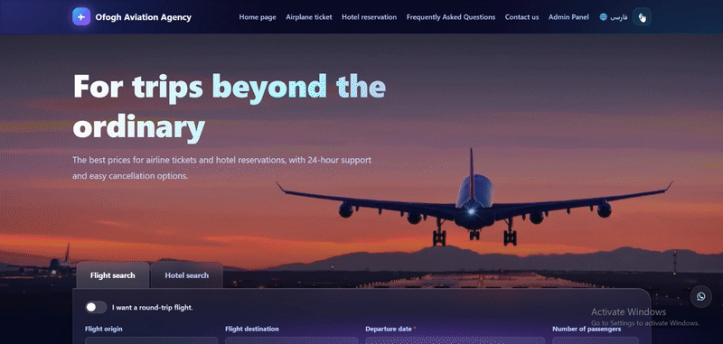
</td>
</tr>
</table>

---

## 🛠️ Admin panel

A protected area (cookie login) with three sections: **flights**, **hotels** and **bookings**.

### 🏨 Add a hotel

<table>
<tr>
<td width="56%" valign="top">

A smart form that saves the admin's time.

<ul>
<li>Start typing a hotel name and existing hotels are suggested</li>
<li>Pick one and <b>province, stars, address and hotel photos fill in automatically</b>. You only add the dates and the room's own data</li>
<li>Hotel not in the list? Choose <b>Add new hotel</b> and enter everything yourself</li>
<li>Set a <b>discount</b> while adding; it appears automatically on the home page's hotel deals and can be booked at that price</li>
</ul>

</td>
<td width="44%" align="center" valign="middle">
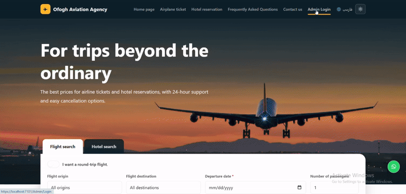
</td>
</tr>
</table>

### 📋 Manage bookings

<table>
<tr>
<td width="56%" valign="top">

Every reservation in one place.

<ul>
<li>Bookings are <b>split into flights and hotels</b></li>
<li>A dropdown filters by <b>successful</b>, <b>failed</b> or all bookings</li>
<li>The admin can open, edit or delete a reservation</li>
<li>Flights and hotels can be created, viewed, edited and deleted</li>
</ul>

</td>
<td width="44%" align="center" valign="middle">
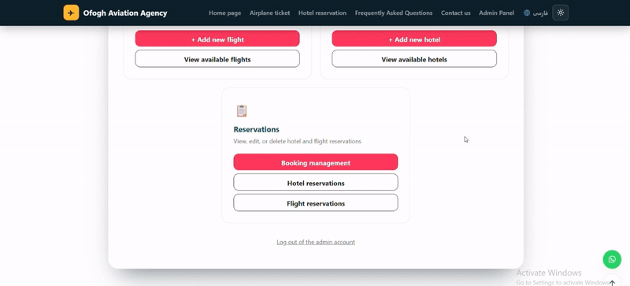
</td>
</tr>
</table>

### 🛡️ Delete protection

<table>
<tr>
<td width="56%" valign="top">

Data with real bookings can't be removed by accident.

<ul>
<li>A <b>flight</b> with even one booking can't be deleted</li>
<li>A <b>hotel</b> with a booking can't be deleted</li>
<li>Reservations themselves can still be edited or removed by the admin</li>
</ul>

</td>
<td width="44%" align="center" valign="middle">
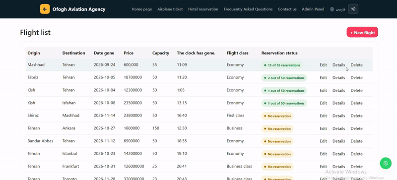
</td>
</tr>
</table>

<div align="center">
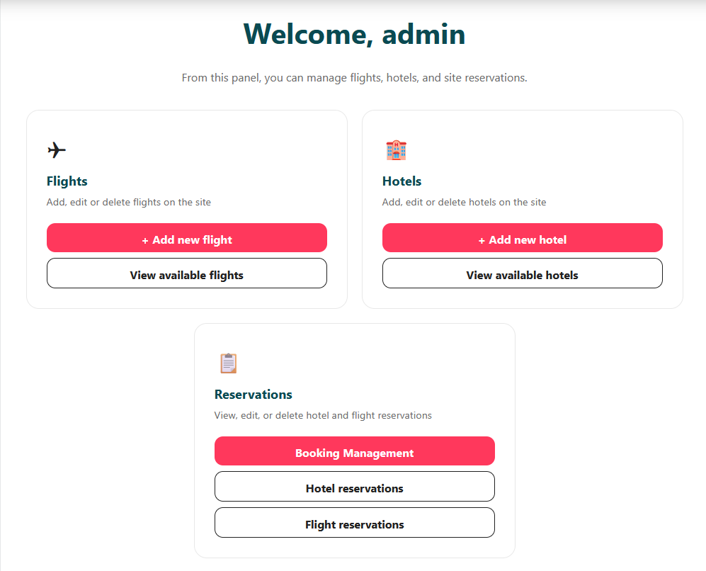<br>
<sub>The admin panel</sub>
</div>

---

## 🔄 How it works

### Booking flow

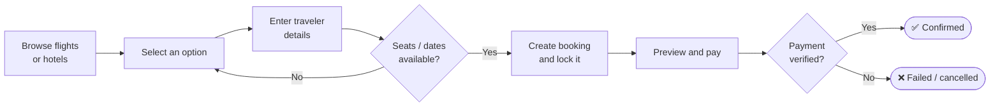

### Booking states

Every reservation moves through a clear lifecycle, with temporary locks that expire so seats and rooms are never held forever.

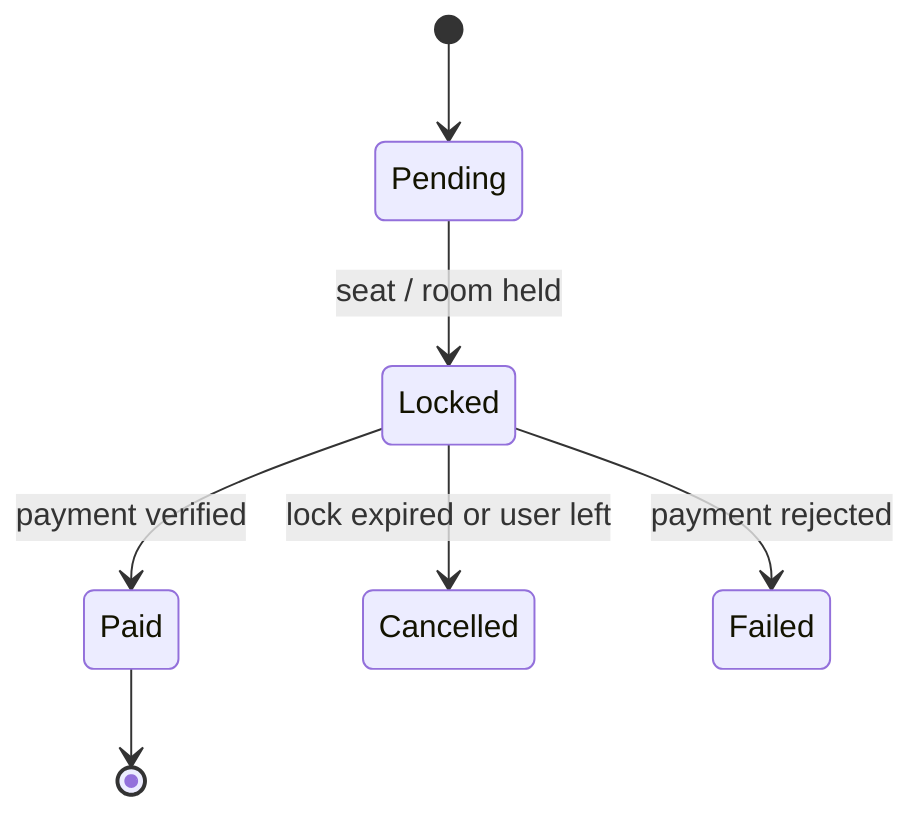

### Architecture

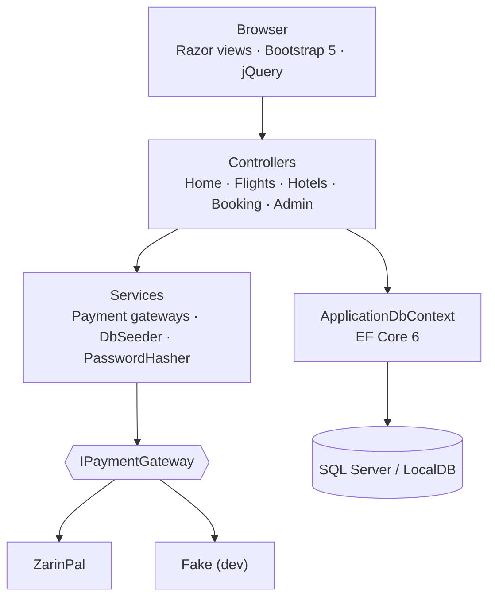

---

## 🛡️ Built-in business rules

| Area | Rule |
|---|---|
| Flights | Date can't be in the past · capacity and price must be positive |
| Flights | Seats are counted per booking; a request beyond capacity is rejected |
| Flights | Can't be deleted while bookings exist |
| Hotels | Rating 1–5 · valid availability range · positive price and room capacity |
| Hotels | Check-out must be after check-in · overlapping bookings are blocked |
| Hotels | Can't be deleted while bookings exist |
| Passengers | Mobile numbers and seat counts are validated server-side |
| Bookings | Temporary locks expire automatically |

---

## 🚀 Quick start

**Requirements:** [.NET 6 SDK](https://dotnet.microsoft.com/download/dotnet/6.0) and SQL Server or SQL Server LocalDB.

```bash
# 1. Clone
git clone https://github.com/arefesab/Website-Travel-Agency-System.git
cd Website-Travel-Agency-System

# 2. Restore packages
dotnet restore

# 3. Create the database
dotnet ef database update

# 4. Run
dotnet run
```

Open the local URL printed in the terminal. On first run the database is **seeded automatically** with sample data, so you can start exploring right away.

> The default connection string uses LocalDB: `(localdb)\MSSQLLocalDB`.
> To use another server, edit `ConnectionStrings:DefaultConnectionString` in `appsettings.json`.

---

## 💳 Payments

The project ships with the **Fake** gateway enabled, so you can test the full booking-and-payment flow without any bank credentials.

```jsonc
// appsettings.json (development)
"Payment": {
  "Provider": "Fake"
}
```

To switch to ZarinPal:

```jsonc
"Payment": {
  "Provider": "Zarinpal",
  "Zarinpal": {
    "MerchantId": "YOUR_MERCHANT_ID",
    "Sandbox": true
  }
}
```

> ⚠️ Never commit a real merchant ID or any production secret to source control.

---

## 🧰 Tech stack

| Layer | Technology |
|---|---|
| Backend | C# · .NET 6 · ASP.NET Core MVC |
| Data | Entity Framework Core 6 · SQL Server / LocalDB · migrations + seeding |
| Auth | Cookie authentication with hashed passwords |
| Frontend | Razor · HTML5 · CSS3 · JavaScript · Bootstrap 5 · jQuery |
| Integrations | ZarinPal · WhatsApp · Google Translate |

---

## 📁 Project structure

```text
├── Controllers/      Flights, Hotels, Booking, FlightBooking, Admin, AdminBookings, Home
├── Models/DB/        Flight · Hotel · Booking · FlightBooking · UserLogin
├── Services/         DbSeeder · PasswordHasher · Payment/ (IPaymentGateway, Fake, Zarinpal)
├── Helpers/          Localization (Lang), flight routes, hotel pricing
├── Data/             ApplicationDbContext
├── Migrations/       EF Core migrations
├── Views/            Razor views for every section + Shared layouts
├── wwwroot/          css · js · lib · uploads
└── docs/             gifs · screenshots used in this README
```

---

## 🗺️ Roadmap

- [ ] Unit and integration tests
- [ ] CI/CD with GitHub Actions
- [ ] Admin analytics dashboard
- [ ] Email / SMS booking notifications
- [ ] Customer accounts with booking history
- [ ] Role-based authorization
- [ ] Centralized logging
- [ ] REST API for mobile clients

---

## 👤 Author

**Aref Sab** · [@arefesab](https://github.com/arefesab)

<div align="center">
<sub>If you find this project useful, a ⭐ on the repo is appreciated.</sub>
</div>
