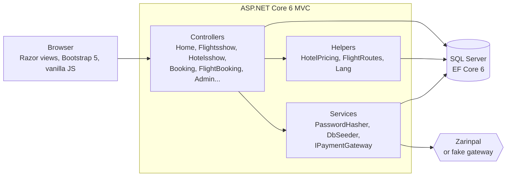
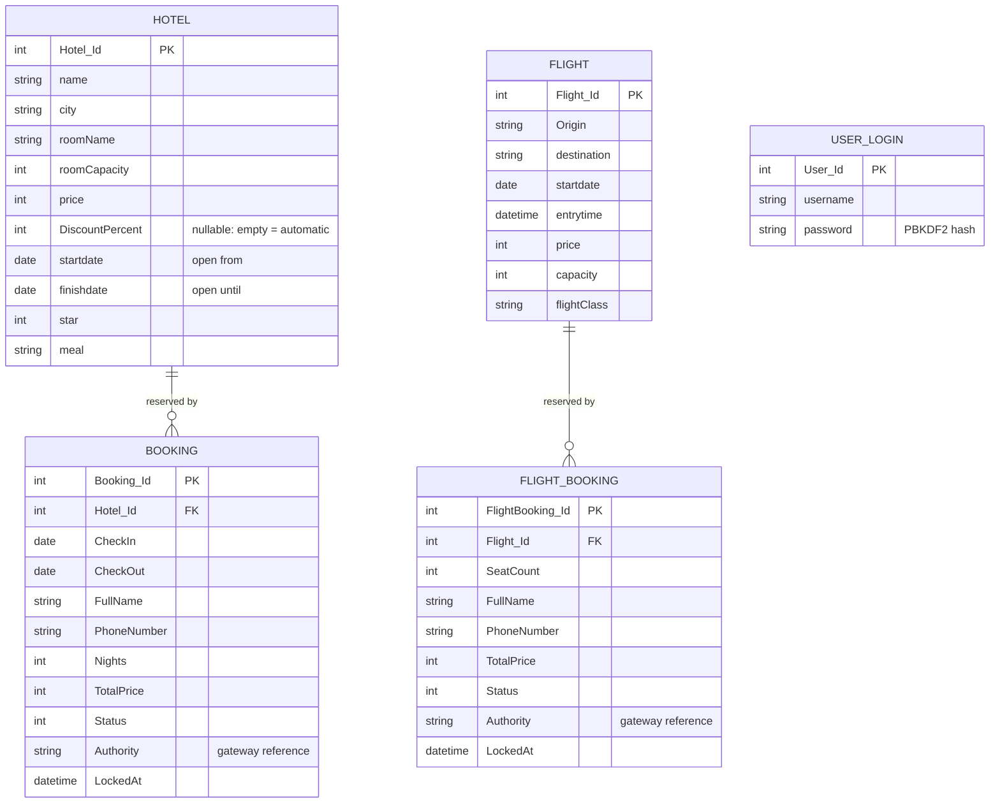
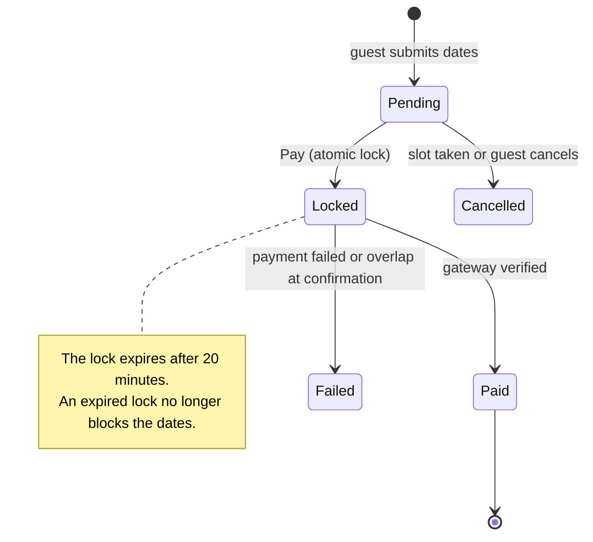
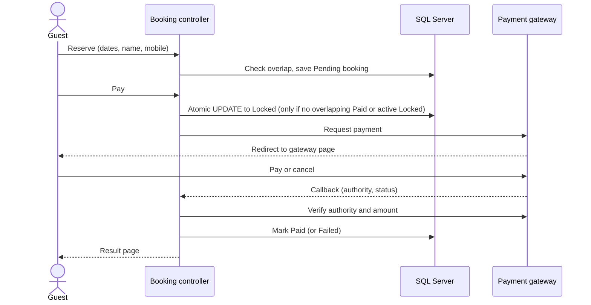

<p align="center">
  
</p>

<p align="center">
  
  
  
  
  
  
  
  <a href="https://github.com/arefesab"></a>
</p>

**Ofogh Air Agency** is a full-stack travel-agency web application built with **ASP.NET Core 6 MVC**. Visitors search flights and hotel rooms, reserve them and pay online; the agency manages its whole catalogue and every booking from a protected admin panel. Key features include:

- 🔎 Flight and hotel search driven by **real availability** - already-booked seats and date ranges are excluded automatically.
- 🔒 A **double-booking-safe** reservation flow: an atomic database lock, a 20-minute payment window and a pluggable payment gateway (Zarinpal or a built-in simulator).
- 🏷️ A **dynamic pricing engine**: rooms that are free tomorrow get an automatic discount, and the admin can override it per room.
- 🛠️ A complete **admin panel** for flights, hotels (with photo upload) and bookings.
- 🌙 Persian (RTL) first, **English on demand**, light/dark theme and scroll animations that respect reduced-motion settings.

> **Note:** this is a demo project. Payments run through a **simulated gateway** by default (no real money moves), and the hotel names and photos are sample data used for demonstration only.

---

## 🖼️ Preview

<p align="center">
  
</p>

---

## ✨ Features

| 🏠 Home page<br>A landing page designed to turn visitors into bookings.<br><br>**Search widget**: switch between flights and hotels, one-way or round trip, with date pickers and passenger count.<br>**Departures board**: last-minute flights on an airport-style board; rows flip in as it scrolls into view and a chip shows the time left.<br>**Hot hotel deals**: discounted rooms as cards with a discount badge and a "days left" countdown; each hotel appears once, with its best-priced room.<br>**Destinations**: filterable destination cards (domestic / international) linking to eight landing pages (Kish, France, Turkey, Russia, Shiraz, Qeshm, Maldives, Kurdistan).<br>**Trust sections**: "Why Ofogh", traveller testimonials, FAQ and a floating WhatsApp button. |  |
| :--- | :---: |

| ✈️ Flight search<br>Only routes the agency really flies are offered.<br><br>**Real routes only**: the origin and destination lists are built from the flights stored in the database, so a visitor can never pick a route that does not exist.<br>**Round trip**: searches the outbound flight and the matching return flight in one go.<br>**Seat-aware results**: capacity minus paid and currently-locked seats is checked against the number of passengers, and flights without enough seats are hidden.<br>**Validation**: past dates and a return date before the departure date are rejected with clear messages. |  |
| :--- | :---: |

| 🏨 Hotel search & details<br>Find a room that is genuinely free for the chosen nights.<br><br>**Availability-aware**: a room is listed only if the stay fits inside its open window and no paid (or actively locked) booking overlaps it.<br>**Photo carousel**: arrows, thumbnails, swipe, keyboard control and a click-to-enlarge lightbox, for hotel and room photos.<br>**Rich details**: amenities, meal plan, room name and capacity, address and star rating.<br>**Dynamic prices**: the price shown already includes any active discount. |  |
| :--- | :---: |

| 💳 Booking & payment<br>A guided flow from the first click to the receipt.<br><br>**Reserve → Preview → Pay → Result**, for both hotel rooms and flight seats (1-50 seats per booking).<br>**Booked-range awareness**: dates that are already taken are shown to the guest while choosing.<br>**Payment window**: when the guest clicks Pay the slot is locked for 20 minutes; if the payment never completes, the slot is released automatically.<br>**Gateways**: Zarinpal (sandbox or live) or a built-in **fake gateway** page to test the whole flow without a bank. Switch with one config key.<br>**Server-side checks**: the amount is verified with the gateway and the callback must match the stored authority. |  |
| :--- | :---: |

| 🏷️ Dynamic pricing<br>Fill empty rooms without any manual work.<br><br>**Automatic last-minute discount**: a room that is open tomorrow and has no booking for that night gets **15% off** automatically, with a badge that says "Until tomorrow".<br>**Manual override**: the admin can set a discount per room (1-90%) that lasts until the room's end date, or `0` to switch discounts off for that room.<br>**Always consistent**: the same pricing rules drive the home page, the search results, the details page and the final invoice. |  |
| :--- | :---: |

| 🛠️ Admin panel<br>Everything the agency needs in one protected area.<br><br>**Secure login**: cookie authentication, anti-forgery tokens and PBKDF2-hashed passwords.<br>**Flights**: add, edit and delete flights with class, capacity, price and departure time.<br>**Hotels**: add rooms with multi-photo upload. Adding another room to an existing hotel **auto-fills** its description, amenities, address, stars and photos.<br>**Bookings**: one table for hotel and flight bookings with search by name or mobile, filters by type and status, colour-coded status pills, and quick edit/delete. |  |
| :--- | :---: |

| 🌍 Language, theme & motion<br>Built for Persian users, usable by everyone.<br><br>**Persian first (RTL)**: the whole interface is written in Persian with a right-to-left layout.<br>**English on demand**: one click switches to English through Google Website Translator and flips the layout to LTR; the choice is remembered in a cookie.<br>**Light / dark mode**: a theme toggle remembered between visits, with no flash of the wrong colours on load.<br>**Scroll animations**: sections and cards fade in as they enter the viewport (IntersectionObserver); everything is disabled for visitors who prefer reduced motion.<br>**Responsive**: designed for phones, tablets and desktops. |  |
| :--- | :---: |

---

## ⚙️ Tech Stack

- **Backend:** C# 10, [ASP.NET Core 6 MVC](https://learn.microsoft.com/aspnet/core/mvc/overview) with Razor views
- **Data:** [Entity Framework Core 6](https://learn.microsoft.com/ef/core/) (code-first migrations) on **SQL Server**
- **Auth & security:** cookie authentication, anti-forgery tokens, PBKDF2-SHA256 password hashing
- **Payments:** gateway abstraction (`IPaymentGateway`) with a Zarinpal implementation and a fake gateway for development
- **Frontend:** Bootstrap 5, jQuery + unobtrusive validation, vanilla JavaScript (no frontend framework), custom CSS with design tokens for the light/dark themes
- **Browser APIs:** IntersectionObserver for scroll effects, Fetch for photo upload
- **i18n:** Persian (RTL) by default, English through Google Website Translator

## 🏛️ Architecture

A classic layered MVC application: controllers stay thin, business rules live in helpers and services, and EF Core is the single gateway to the database.



### Data model



### Booking lifecycle

A booking moves through a small state machine. The critical step is **Pending → Locked**, which is done in a single SQL `UPDATE ... WHERE NOT EXISTS (...)` so two guests can never lock overlapping dates at the same time.





## 🔒 Security & Engineering Notes

- **No double booking:** the lock is an atomic conditional `UPDATE`, not an in-memory check; payment-time and callback-time overlap checks protect against races.
- **Passwords:** PBKDF2-SHA256, 100,000 iterations, 16-byte random salt, constant-time comparison. Legacy plain-text passwords are upgraded to hashes transparently on the first successful login.
- **Request safety:** anti-forgery tokens on every POST, `[Authorize]` on all admin actions, parameterised SQL, and model validation with localised messages.
- **Uploads:** extension allow-list (jpg, jpeg, png, webp, gif), random GUID file names and a request-size limit.
- **Payment integrity:** the gateway callback must match the stored authority, and the paid amount is verified server-side before a booking is marked as paid.
- **Integer-safe prices:** price maths uses 64-bit integers before rounding, so large room prices cannot overflow.
- **Idempotent seeding:** on an empty database the app applies migrations, creates the admin account and loads sample data. Seed dates are stored as *day offsets*, so the sample flights and hotel windows are always in the future.
- **Accessibility:** ARIA labels on controls and `prefers-reduced-motion` support.

## 🚀 Getting Started

### Prerequisites

- [.NET 6 SDK](https://dotnet.microsoft.com/download/dotnet/6.0)
- SQL Server - the default connection string uses **LocalDB** (Windows, installed with Visual Studio). Any SQL Server / SQL Server Express instance works if you change the connection string.

### Run locally

```bash
git clone https://github.com/arefesab/Website-Travel-Agency-System.git
cd Website-Travel-Agency-System

# Optional: choose the admin credentials (otherwise a random password is printed in the console on first run)
dotnet user-secrets init
dotnet user-secrets set "Seed:AdminUsername" "admin"
dotnet user-secrets set "Seed:AdminPassword" "choose-a-strong-password"

dotnet run
```

Open **https://localhost:7101**. On the first run against an empty database the app creates the schema, the admin user and the sample hotels and flights. The admin panel is at **`/Admin/Login`**.

<details>
<summary><b>⚙️ Configuration reference</b></summary>

| Key | Default | Description |
| --- | --- | --- |
| `ConnectionStrings:DefaultConnectionString` | LocalDB `agancydb` | SQL Server connection string |
| `Payment:Provider` | `Fake` | `Fake` = simulated gateway page, `Zarinpal` = real or sandbox gateway |
| `Payment:Zarinpal:MerchantId` | empty | Your Zarinpal merchant ID (only for `Zarinpal`) |
| `Payment:Zarinpal:Sandbox` | `true` | Use the Zarinpal sandbox endpoint |
| `Seed:AdminUsername` | `admin` | Username of the admin created on a fresh database |
| `Seed:AdminPassword` | random | Password of that admin; if empty, a random one is logged once |
| `Seed:Force` | `false` | Also fill empty hotel/flight tables on a database that already has users |

Keep real secrets (merchant ID, admin password) in `dotnet user-secrets` or environment variables, never in `appsettings.json`.

</details>

<details>
<summary><b>📁 Project structure</b></summary>

```
agancywebProject/
├── Controllers/      Public pages, booking flows, admin CRUD
├── Models/DB/        EF Core entities: Hotel, Flight, Booking, FlightBooking, UserLogin
├── Data/             ApplicationDbContext
├── Migrations/       EF Core code-first migrations
├── Services/         PasswordHasher, DbSeeder, Payment/ (IPaymentGateway, Zarinpal, Fake)
├── Helpers/          HotelPricing (discount rules), FlightRoutes, Lang (i18n)
├── Views/            Razor views and shared partials
├── SeedData/         seed.json - sample hotels and flights (dates as day offsets)
├── Program.cs        Service registration, authentication, startup seeding
└── wwwroot/          css, js, lib, uploads/hotels
```

</details>

---

## 📸 Gallery

<table>
  <tr>
    <td></td>
    <td></td>
    <td></td>
  </tr>
  <tr>
    <td align="center"><sub>Departures board</sub></td>
    <td align="center"><sub>Booking management</sub></td>
    <td align="center"><sub>Mobile layout</sub></td>
  </tr>
</table>

## 👩‍💻 Author

Built by **[arefesab](https://github.com/arefesab)**.
